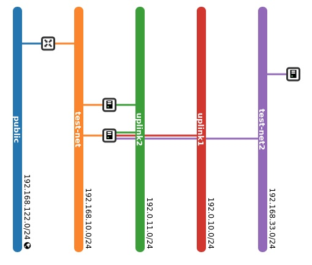

# Demo

This folder contains a demo of using the various tools to analyze and recreate an OSP deployment on OVN.

## Topology



## Gather

Retrieve OVN north and south databases using **Gather**.

`go run cmd/gather/main.go -nb -sb -o demo osp 192.168.25.30:22`

## Schema (Optional)

Generate **Golang** scema code

`go run cmd/schema/main.go -o demo/ovn_northbound.go demo/ovnnb_db.db`
`go run cmd/schema/main.go -o demo/ovn_southbound.go demo/ovnsb_db.db`

## DB

Generate the informational files

`go run cmd/db/main.go -v -o demo -jd -ds demo/ovnnb_db.db`

- [ovn_northbound.json](./ovn_northbound.json)
- [ovn_northbound.dot](./ovn_northbound.dot)
- [ovn_northbound_stats.txt](./ovn_northbound_stats.txt)

`go run cmd/db/main.go -v -o demo -jd -ds demo/ovnsb_db.db`

- [ovn_southbound.json](./ovn_southbound.json)
- [ovn_southbound.dot](./ovn_southbound.dot)
- [ovn_southbound_stats.txt](./ovn_southbound_stats.txt)

## Gen

Generate shell scripts with OVN commands to populate the northbound database and to setup the ovn-scale-test environment.

`go run cmd/gen/main.go -o demo demo/ovnnb_db.db demo/ovnsb_db.db`

- [ovn_nb_net.sh](./ovn_nb_net.sh)
- [inventory_ovn.yaml](./inventory_ovn.yaml)
- Individual files for each chassis ([sos-novaocmpute-0.localdomain-ovs](./sos-novacompute-0.localdomain-ovs))

## ovs-scale-test setup

Copy the generated *ovn_nb_net.sh*, *inventory_ovn.yaml* and individual *chassis-name(s).sh* files to the **ovn-scale-test**
controller server.

```bash
scp ovn_nb_net.sh sos-novacompute-0.localdomain-ovs inventory_ovn.yaml root@X.X.X.X:/root
```

Run the **flowt** playbook to deploy the framework for use with the OVN northbound database configuration.

`ansible-playbook -i inventory -e @params.yaml -e @../inventory_ovn.yaml deploy_flowt.yaml`

```text
[root@rhos-nfv-02 ovn-scale-tests]# podman ps
CONTAINER ID  IMAGE                      COMMAND            CREATED             STATUS                 PORTS                               NAMES
38eb95377ae6  k8s.gcr.io/pause:3.5                          About a minute ago  Up About a minute ago  0.0.0.0:36323-40779->6641-6642/tcp  e5bca1d39cce-infra
2ab43d3c9d41  localhost/ovn-base:latest  tail -f /dev/null  About a minute ago  Up About a minute ago  0.0.0.0:36323-40779->6641-6642/tcp  northd
6c794775b419  k8s.gcr.io/pause:3.5                          About a minute ago  Up About a minute ago                                      71da54beb17d-infra
e5517e35d683  localhost/ovn-base:latest  tail -f /dev/null  About a minute ago  Up About a minute ago                                      sos-novacompute-0.localdomain-ovs
11681e310baa  localhost/ovn-base:latest  tail -f /dev/null  About a minute ago  Up About a minute ago                                      sos-novacompute-0.localdomain-ovn-controller
```

## Populate the northbound database

Copy the northbound config script to the northbound controller pod

`podman cp ../ovn_nb_net.sh northd:/root`

Enter the controller pod

`podman exec -ti northd /bin/bash`

Execute the norbound config script

`. ovn_nb_net.sh`

Verify general northbound configuration

```bash
[root@controller-rhos-nfv-02 ~]# ovn-nbctl show
switch 1bee0964-a9b8-49c4-8666-a8925a965535 (neutron-561990d3-f4d5-431d-ae92-a85b83f4f570) (aka public)
    port f6e94716-7c85-403e-98ad-f42c19e7f6e5
        type: localport
        addresses: ["fa:16:3e:e6:32:42"]
    port 2442a8af-8399-4cfb-86fc-5b379b8cf6b9
        type: router
        router-port: lrp-2442a8af-8399-4cfb-86fc-5b379b8cf6b9
    port provnet-58b5c9c3-7645-4eb9-9c2f-ae5e21cf66f0
        type: localnet
        addresses: ["unknown"]
switch 7fd6322a-640d-4e09-95ae-21a55b9d964b (neutron-d8953248-ba41-4ef4-b7a3-471afed8fd8f) (aka uplink1)
    port 008572d0-b96b-40ef-a3b0-6b20f3650390
        type: localport
        addresses: ["fa:16:3e:27:83:73"]
    port 8b332d14-b00a-4e75-af70-eac6e56afec4
        addresses: ["fa:16:3e:a9:2d:c1 192.0.10.141"]
    port provnet-27023655-efe2-4757-859b-2e0121b685a3
        type: localnet
        addresses: ["unknown"]
switch 86da5b3e-da6b-4c82-a491-5c2fa98da68b (neutron-82e03259-6310-4b9d-9575-7f07d613ce09) (aka test-net)
    port a5525be6-6773-4438-8e2a-cd7b41223ff4
        type: router
        router-port: lrp-a5525be6-6773-4438-8e2a-cd7b41223ff4
    port 71d95a8d-9844-409b-b113-d40250684a69
        addresses: ["fa:16:3e:d7:da:20 192.168.10.68"]
    port 1d7ec5b6-6c82-49cc-b940-e46c63c59148
        addresses: ["fa:16:3e:88:a9:43 192.168.10.203"]
    port d0327ab0-796b-4e17-9f4d-9aaa6b42107d
        type: localport
        addresses: ["fa:16:3e:1c:fa:a5 192.168.10.2"]
switch 419b8333-9a43-4965-8918-8c8795ec3a19 (neutron-a6e858b0-c295-41d4-8ff4-858c18695d0c) (aka uplink2)
    port 6189098b-df23-4ca1-9062-2b756cad6acc
        addresses: ["fa:16:3e:d7:13:a4 192.0.11.116"]
    port bd253cba-647a-4264-97c2-b16c6196e414
        type: localport
        addresses: ["fa:16:3e:57:37:78"]
    port 6cbd2589-3c49-4f6a-a139-8cd6fa93522e
        addresses: ["fa:16:3e:a9:84:91 192.0.11.219"]
    port provnet-4dfd6d92-5415-4c83-890a-5aa4f28be252
        type: localnet
        addresses: ["unknown"]
switch f2d558ff-8a20-4bb6-b39e-ed702bea960e (neutron-496db99d-97cc-4d52-ab60-2d1386d3626c) (aka test-net2)
    port 23d0ed6c-a799-451c-9c69-536ae9079081
        addresses: ["fa:16:3e:9f:a8:7e 192.168.33.40"]
    port d54273a6-ecbd-4ab0-ba13-adbd2a2ae204
        type: localport
        addresses: ["fa:16:3e:14:05:e3 192.168.33.100"]
    port 9fbc5b58-cf4c-4e83-8801-a73b41bdf27b
        addresses: ["fa:16:3e:94:cf:4a 192.168.33.102"]
router 59ddf429-8bb9-409e-99a3-e23494aec25f (neutron-72adf022-c39d-4c21-8120-5135f066aa01) (aka public)
    port lrp-a5525be6-6773-4438-8e2a-cd7b41223ff4
        mac: "fa:16:3e:ff:cd:02"
        networks: ["192.168.10.1/24"]
    port lrp-2442a8af-8399-4cfb-86fc-5b379b8cf6b9
        mac: "fa:16:3e:de:b5:e3"
        networks: ["192.168.122.141/24"]
        gateway chassis: [103ca35b-b7ab-4349-a57d-cf9da2ec0e79]
    nat 12e0782e-b6a1-4741-9fc6-3f37369f175f
        external ip: "192.168.122.127"
        logical ip: "192.168.10.68"
        type: "dnat_and_snat"
    nat c10ef389-0e44-4ff5-aac7-5d4ffb42e724
        external ip: "192.168.122.141"
        logical ip: "192.168.10.0/24"
        type: "snat"
```

## Configure the VM emulation pod(s)

Return to the **ovn-scale-test** server.

Copy each ovs configuration script to the appropriate pod.

`podman cp ../sos-novacompute-0.localdomain-ovs sos-novacompute-0.localdomain-ovs:/root`

Login to the pod and execute the script

```bash
podman exec -ti sos-novacompute-0.localdomain-ovs /bin/bash
. sos-novacompute-0.localdomain-ovs
```

```text
[root@cpt-sos-novacompute-0 ovn]# ovs-vsctl show
90142497-8bfd-479a-8552-9dd0ad8be7c9
    Bridge br-ex
        datapath_type: system
        Port br-ex
            Interface br-ex
                type: internal
        Port eth2
            Interface eth2
    Bridge br-int
        fail_mode: secure
        datapath_type: system
        Port "1d7ec5b6-6c82-4"
            Interface "1d7ec5b6-6c82-4"
                type: internal
        Port "8b332d14-b00a-4"
            Interface "8b332d14-b00a-4"
                type: internal
        Port "23d0ed6c-a799-4"
            Interface "23d0ed6c-a799-4"
                type: internal
        Port br-int
            Interface br-int
                type: internal
        Port "9fbc5b58-cf4c-4"
            Interface "9fbc5b58-cf4c-4"
                type: internal
        Port "6cbd2589-3c49-4"
            Interface "6cbd2589-3c49-4"
                type: internal
        Port "6189098b-df23-4"
            Interface "6189098b-df23-4"
                type: internal
        Port "71d95a8d-9844-4"
            Interface "71d95a8d-9844-4"
                type: internal
    ovs_version: "2.16.90"
```

[root@cpt-sos-novacompute-0 ovn]# ip netns
17df02cc-5577-4f07-a150-49e6499381c8 (id: 1)
1e8f9d6d-eb56-485e-8f84-6bd622a6c5dc (id: 3)
4082929f-7ab4-4b76-b06f-fd5dea91c609 (id: 2)

The 17df02cc-5577-4f07-a150-49e6499381c8 namespace corresponds to one of the VMs (hub) in the actual OSP deployment.
The entry below shows one of the ports on the VM as represented in the northbound datbase.

```json
{
    "addresses": [
        "fa:16:3e:d7:da:20 192.168.10.68"
    ],
    "dhcpv4_options": "1d646b6e-fcce-4b0a-8895-5e173e6648f9",
    "enabled": true,
    "external_ids": {
        "neutron:cidrs": "192.168.10.68/24",
        "neutron:device_id": "17df02cc-5577-4f07-a150-49e6499381c8",
        "neutron:device_owner": "compute:nova",
        "neutron:network_name": "neutron-82e03259-6310-4b9d-9575-7f07d613ce09",
        "neutron:port_fip": "192.168.122.127",
        "neutron:port_name": "",
        "neutron:project_id": "ff0b6fda266d4d12a0df787aa41f1bb2",
        "neutron:revision_number": "5",
        "neutron:security_group_ids": "6558094b-5c0d-4258-93ab-6efc734c80bc f7baaa68-b46e-4977-a361-66b2e21bf35b"
    },
    "name": "71d95a8d-9844-409b-b113-d40250684a69",
    "options": {
        "mcast_flood_reports": "true",
        "requested-chassis": "sos-novacompute-0.localdomain"
    },
    "port_security": [
        "fa:16:3e:d7:da:20 192.168.10.68"
    ],
    "type": null,
    "up": true
}
```

An inspection of the namespace shows:

```text
[root@cpt-sos-novacompute-0 ovn]# ip netns exec 17df02cc-5577-4f07-a150-49e6499381c8 ip a
1: lo: <LOOPBACK,UP,LOWER_UP> mtu 65536 qdisc noqueue state UNKNOWN group default qlen 1000
    link/loopback 00:00:00:00:00:00 brd 00:00:00:00:00:00
    inet 127.0.0.1/8 scope host lo
       valid_lft forever preferred_lft forever
    inet6 ::1/128 scope host
       valid_lft forever preferred_lft forever
6: 8b332d14-b00a-4: <BROADCAST,MULTICAST,UP,LOWER_UP> mtu 1500 qdisc noqueue state UNKNOWN group default qlen 1000
    link/ether fa:16:3e:a9:2d:c1 brd ff:ff:ff:ff:ff:ff
    inet 192.0.10.141/24 scope global 8b332d14-b00a-4
       valid_lft forever preferred_lft forever
    inet6 fe80::f816:3eff:fea9:2dc1/64 scope link
       valid_lft forever preferred_lft forever
8: 9fbc5b58-cf4c-4: <BROADCAST,MULTICAST,UP,LOWER_UP> mtu 1500 qdisc noqueue state UNKNOWN group default qlen 1000
    link/ether fa:16:3e:94:cf:4a brd ff:ff:ff:ff:ff:ff
    inet 192.168.33.102/24 scope global 9fbc5b58-cf4c-4
       valid_lft forever preferred_lft forever
    inet6 fe80::f816:3eff:fe94:cf4a/64 scope link
       valid_lft forever preferred_lft forever
9: 6cbd2589-3c49-4: <BROADCAST,MULTICAST,UP,LOWER_UP> mtu 1500 qdisc noqueue state UNKNOWN group default qlen 1000
    link/ether fa:16:3e:a9:84:91 brd ff:ff:ff:ff:ff:ff
    inet 192.0.11.219/24 scope global 6cbd2589-3c49-4
       valid_lft forever preferred_lft forever
    inet6 fe80::f816:3eff:fea9:8491/64 scope link
       valid_lft forever preferred_lft forever
12: 71d95a8d-9844-4: <BROADCAST,MULTICAST,UP,LOWER_UP> mtu 1500 qdisc noqueue state UNKNOWN group default qlen 1000
    link/ether fa:16:3e:d7:da:20 brd ff:ff:ff:ff:ff:ff
    inet 192.168.10.68/24 scope global 71d95a8d-9844-4
       valid_lft forever preferred_lft forever
    inet6 fe80::f816:3eff:fed7:da20/64 scope link
       valid_lft forever preferred_lft forever
```

Port *71d95a8d-9844-4* corresponds to the db snippet shown above.
As is shown, the port ip address is 192.168.10.68/24 with a:16:3e:d7:da:20 as the MAC address.

The deployment has a second VM attached to the *192.168.10.0/24* network, which is indicated by the namespace *4082929f-7ab4-4b76-b06f-fd5dea91c609*.

```text
[root@cpt-sos-novacompute-0 ovn]# ip netns exec 4082929f-7ab4-4b76-b06f-fd5dea91c609 ip a
1: lo: <LOOPBACK,UP,LOWER_UP> mtu 65536 qdisc noqueue state UNKNOWN group default qlen 1000
    link/loopback 00:00:00:00:00:00 brd 00:00:00:00:00:00
    inet 127.0.0.1/8 scope host lo
       valid_lft forever preferred_lft forever
    inet6 ::1/128 scope host 
       valid_lft forever preferred_lft forever
7: 6189098b-df23-4: <BROADCAST,MULTICAST,UP,LOWER_UP> mtu 1500 qdisc noqueue state UNKNOWN group default qlen 1000
    link/ether fa:16:3e:d7:13:a4 brd ff:ff:ff:ff:ff:ff
    inet 192.0.11.116/24 scope global 6189098b-df23-4
       valid_lft forever preferred_lft forever
    inet6 fe80::f816:3eff:fed7:13a4/64 scope link 
       valid_lft forever preferred_lft forever
10: 1d7ec5b6-6c82-4: <BROADCAST,MULTICAST,UP,LOWER_UP> mtu 1500 qdisc noqueue state UNKNOWN group default qlen 1000
    link/ether fa:16:3e:88:a9:43 brd ff:ff:ff:ff:ff:ff
    inet 192.168.10.203/24 scope global 1d7ec5b6-6c82-4
       valid_lft forever preferred_lft forever
    inet6 fe80::f816:3eff:fe88:a943/64 scope link 
       valid_lft forever preferred_lft forever
```

Test the connectivity between the two interfaces:

```text
[root@cpt-sos-novacompute-0 ovn]# ip netns exec 17df02cc-5577-4f07-a150-49e6499381c8 ping 192.168.10.68
PING 192.168.10.68 (192.168.10.68) 56(84) bytes of data.
64 bytes from 192.168.10.68: icmp_seq=1 ttl=64 time=0.016 ms
```
