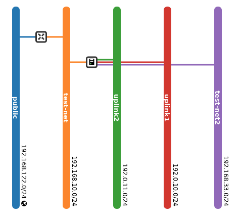
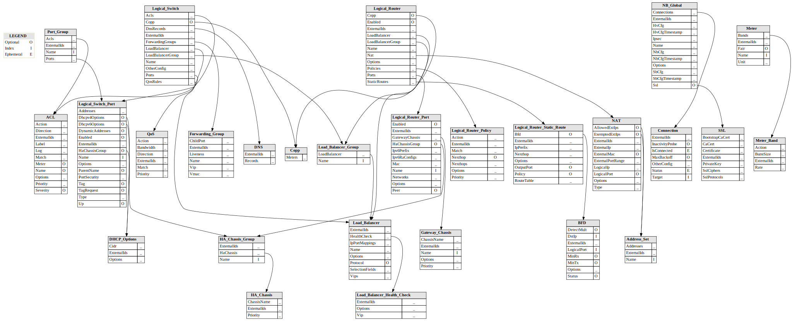
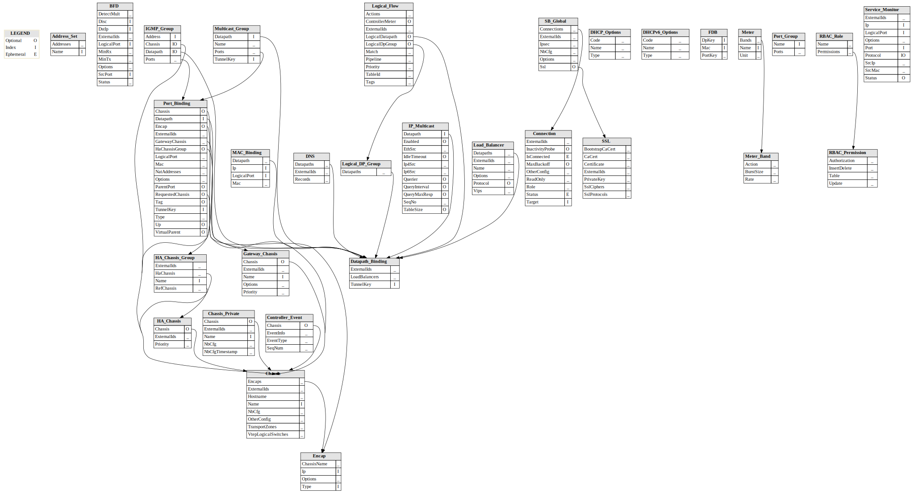

# Example

This diretory contains an OVN nb and sb database and files
generated by programs in this project.

## Files

- ovnnb_db.db -- Northbound database
- ovnsb_db.db -- Southbound database
- ../pkg/dbtypes/ovn_northbound.go -- Go structures to match NB schema
- ../pkg/dbtypes/ovn_southbound.go -- Go structures to match SB schema
- ovn_nortbound.json -- NB DB data as pretty JSON
- ovn_southbound.json -- SB DB data as pretty JSON
- ovn_northbound.dot -- Dot format Graphviz file of NB schema
- ovn_southbound.dot -- Dot format Graphviz file of SB schema
- ovn_northbound.sh -- Shell script of commands to generate NB database
- ovn_northbound.svg -- SVG file of northbound database
- ovn_southbound.svg -- SVG file of southbound database

## Sample Output

```text
go run cmd/db/main.go -v -o example example/ovnnb_db.db  
Date                     54348-06-18 03:28:35 +0000 UTC   
Comment                  "compacting database online"
IsDiff                   true   
ACL                      15
AddressSet               0
BFD                      0                      
Connection               1               
Copp                     0                     
DHCPOptions              2              
DNS                      0                      
ForwardingGroup          0          
GatewayChassis           1           
HAChassis                1                
HAChassisGroup           1           
LoadBalancer             0             
LoadBalancerGroup        0        
LoadBalancerHealthCheck  0  
LogicalRouter            1            
LogicalRouterPolicy      0      
LogicalRouterPort        2        
LogicalRouterStaticRoute 2 
LogicalSwitch            5            
                         neutron-d8953248-ba41-4ef4-b7a3-471afed8fd8f    3 Ports            
                         neutron-a6e858b0-c295-41d4-8ff4-858c18695d0c    3 Ports            
                         neutron-82e03259-6310-4b9d-9575-7f07d613ce09    3 Ports            
                         neutron-496db99d-97cc-4d52-ab60-2d1386d3626c    2 Ports            
                         neutron-561990d3-f4d5-431d-ae92-a85b83f4f570    3 Ports
LogicalSwitchPort        14 0 VMs, 2 Routers, 5 LPorts, 3 LNets
Meter                    0                    
MeterBand                0                
NAT                      2
                         dnat_and_snat    1
                                  snat    1                
Global                   1                 
PortGroup                4                
QoS                      0                      
SSL                      0
```

```text
[kni@rhos-nfv-01 flowt]$ go run cmd/db/main.go -v -o example example/ovnsb_db.db  
Date            54348-06-18 02:24:01 +0000 UTC                         
Comment         compacting database online                       
IsDiff          true                         
AddressSet      9
BFD             0
Chassis         2            
                         sos-novacompute-0.localdomain            
                         controller-0.localdomain
ChassisPrivate  2
Connection      1
ControllerEvent 0
DHCPOptions     37
DHCPv6Options   4
DNS             0
DatapathBinding 6
Encap           2
FDB             0
GatewayChassis  0
HAChassis       1
HAChassisGroup  1
IGMPGroup       0
IPMulticast     5
LoadBalancer    0
LogicalDPGroup  4
LogicalFlow     339
MACBinding      1
Meter           0
MeterBand       0
MulticastGroup  18
PortBinding     17
PortGroup       8
RBACPermission  9
RBACRole        1
SBGlobal        1
SSL             0
ServiceMonitor  0
```

## Realization

The OpenStack deployment shown below is represented inthe above files.



After extraction of the NB database, the following is a realization of
this network deployment on the test platform.

```text
[root@controller-rhos-nfv-02 ovn]# ovn-nbctl show
switch a2e42df0-914a-4b6c-9db1-09e5e19875ce (neutron-496db99d-97cc-4d52-ab60-2d1386d3626c)
    port d54273a6-ecbd-4ab0-ba13-adbd2a2ae204
        type: localport
        addresses: ["fa:16:3e:14:05:e3", "fa:16:3e:14:05:e3 192.168.33.100"]
    port 9fbc5b58-cf4c-4e83-8801-a73b41bdf27b
        addresses: ["fa:16:3e:94:cf:4a 192.168.33.102"]
switch f3c27a10-a1bd-475b-aa7a-209fd79dcb98 (neutron-a6e858b0-c295-41d4-8ff4-858c18695d0c)
    port 6cbd2589-3c49-4f6a-a139-8cd6fa93522e
        addresses: ["fa:16:3e:a9:84:91 192.0.11.219"]
    port bd253cba-647a-4264-97c2-b16c6196e414
        type: localport
        addresses: ["fa:16:3e:57:37:78"]
    port provnet-4dfd6d92-5415-4c83-890a-5aa4f28be252
        type: localnet
        addresses: ["unknown"]
switch 23938095-8ab9-4650-9f86-fbff10634682 (neutron-82e03259-6310-4b9d-9575-7f07d613ce09)
    port d0327ab0-796b-4e17-9f4d-9aaa6b42107d
        type: localport
        addresses: ["fa:16:3e:1c:fa:a5 192.168.10.2"]
    port a5525be6-6773-4438-8e2a-cd7b41223ff4
        type: router
        router-port: lrp-a5525be6-6773-4438-8e2a-cd7b41223ff4
    port 748a84ff-60ff-47e9-b2cd-dcc91cc31cdb
        addresses: ["fa:16:3e:90:63:65 192.168.10.244"]
    port 71d95a8d-9844-409b-b113-d40250684a69
        addresses: ["fa:16:3e:d7:da:20 192.168.10.68"]
switch cccd14ea-6929-4a83-a7a6-5bfbfca2f214 (neutron-71f14623-55d2-4ad3-930a-eb41e74499ad)
    port b4e4d22b-7576-49e9-9759-9b7672b21b41
        type: localport
        addresses: ["fa:16:3e:23:47:0b", "fa:16:3e:23:47:0b 10.0.0.10"]
    port 03a0961b-7ad6-487a-bb2a-5753e522826c
        addresses: ["fa:16:3e:0b:a2:5d 10.0.3.21"]
    port e70452bc-fef4-4f87-bd66-6c88b1f8ba8a
        type: virtual
        addresses: ["fa:16:3e:ee:9a:d8 10.0.0.5"]
    port 9bb9cbcc-a1ea-496b-a0ea-3396864b1ac4
        type: virtual
        addresses: ["fa:16:3e:3b:8d:92 10.0.0.7"]
    port 1b346a67-483e-440b-92cd-d1fc205ac4fd
        addresses: ["fa:16:3e:e9:98:5a 10.0.0.67"]
    port b58a497d-08ea-4dfd-9018-0bcd4a16140f
        addresses: ["fa:16:3e:db:df:0d 10.0.2.87"]
    port 63085c3a-0a4d-43c4-b527-fa5ff9112aba
        addresses: ["fa:16:3e:16:ec:e9 10.0.2.249"]
    port 14dd446e-4e07-43bf-bde0-12655ebb437a
        type: router
        router-port: lrp-14dd446e-4e07-43bf-bde0-12655ebb437a
switch b2b2e5d6-f0b2-4d8e-9e05-3288b7d77857 (neutron-d8953248-ba41-4ef4-b7a3-471afed8fd8f)
    port provnet-27023655-efe2-4757-859b-2e0121b685a3
        type: localnet
        addresses: ["unknown"]
    port 8b332d14-b00a-4e75-af70-eac6e56afec4
        addresses: ["fa:16:3e:a9:2d:c1 192.0.10.141"]
    port 008572d0-b96b-40ef-a3b0-6b20f3650390
        type: localport
        addresses: ["fa:16:3e:27:83:73"]
router 42e640f5-1a41-4d9e-9c56-34a40d2f0dde (neutron-72adf022-c39d-4c21-8120-5135f066aa01)
    port lrp-2442a8af-8399-4cfb-86fc-5b379b8cf6b9
        mac: "fa:16:3e:de:b5:e3"
        networks: ["192.168.122.141/24"]
        gateway chassis: [7417d7c9-d686-49fe-8557-ab4afc38ae40]
    port lrp-a5525be6-6773-4438-8e2a-cd7b41223ff4
        mac: "fa:16:3e:ff:cd:02"
        networks: ["192.168.10.1/24"]
    nat 36e1cbcd-762e-4c1a-8597-db303989091b
        external ip: "192.168.122.141"
        logical ip: "192.168.10.0/24"
        type: "snat"
    nat 4b64d887-a444-4b10-9abf-46f82225caca
        external ip: "192.168.122.127"
        logical ip: "192.168.10.68"
        type: "dnat_and_snat"
    nat badf6486-9c9d-423f-b483-b2c1da856d36
        external ip: "192.168.122.138"
        logical ip: "192.168.10.244"
        type: "dnat_and_snat"
```

## Schemas

### Northbound database schema



### Southbound database schema


